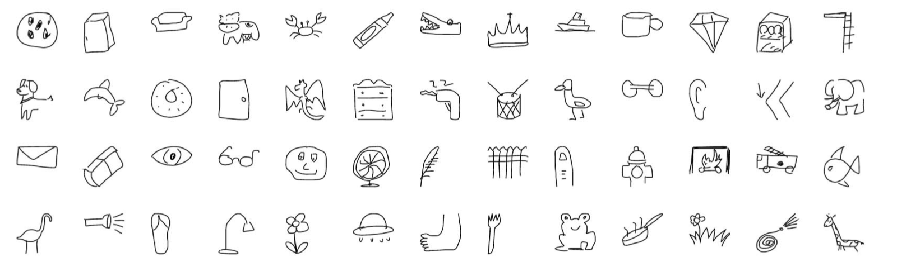
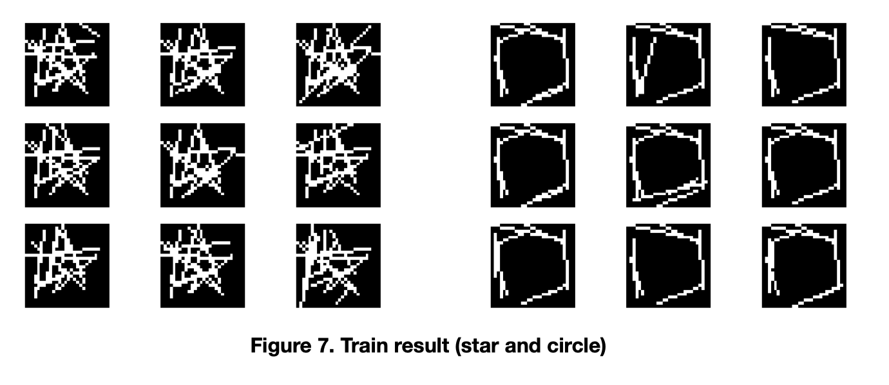

# GA-GAN

This project uses genetic algorithm as the generative model in a tranditional GAN and CNN as the discriminator.

## Dataset

Google's The Quick, Draw! Dataset.

https://github.com/googlecreativelab/quickdraw-dataset

## Result

